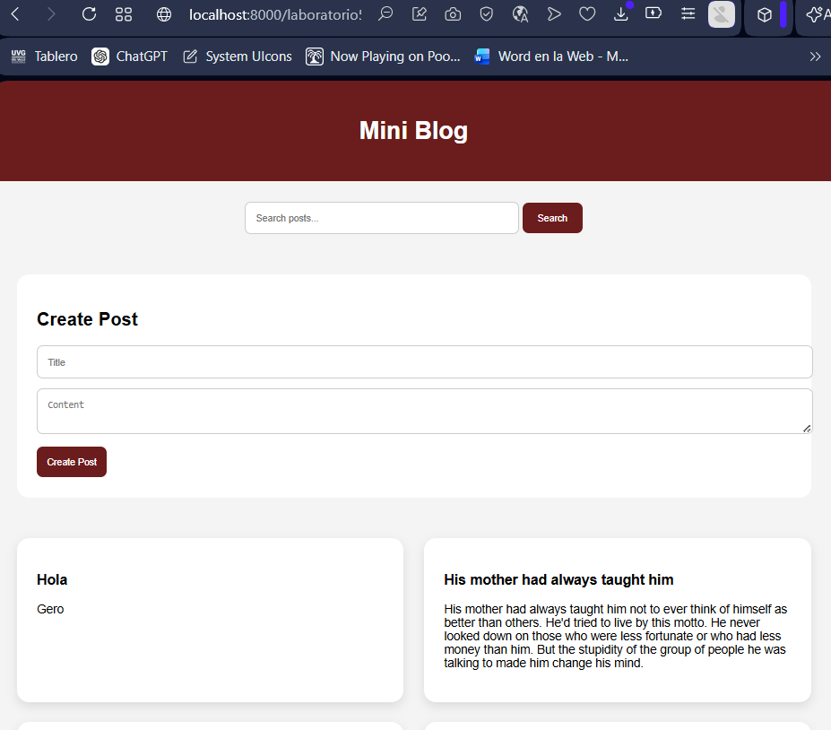

# Mini Blog - Laboratory #5

## Description
This project is a Mini Blog / Bulletin Board web application built using **HTML, CSS, and JavaScript (Vanilla JS)**.

The application consumes the public API from DummyJSON to manage posts and demonstrates DOM manipulation, event handling, API consumption, and UI state management.

---

## Features

- List posts (GET)
- Search posts using query parameters (GET with query)
- Create new posts (POST)
- UI States handling:
  - Idle
  - Loading
  - Success
  - Empty
  - Error (with retry button)

---

## Important Note

The DummyJSON API does not persist new posts.  
To solve this, the application uses **localStorage** to store created posts locally and display them together with API posts.

---

## Technologies Used

- HTML5
- CSS3
- JavaScript (ES6 Modules)
- Fetch API

---

## Project Structure
lab5/
│
├── index.html
├── css/
│ └── styles.css
├── js/
│ ├── app.js
│ ├── api.js
│ ├── posts.js
│ └── ui.js
└── README.md
└── link video

---

## Installation & Usage

1. Clone the repository:
git clone https://github.com/bastmre44/laboratorio5.git

2. Open the project in VS Code

3. Run with Live Server or a local server:
http://localhost:5500

---

## Screenshots

---

## Video

https://www.canva.com/design/DAHEQD5DGtQ/IAOQeJwATqaHCQeP7yg2Vg/edit?utm_content=DAHEQD5DGtQ&utm_campaign=designshare&utm_medium=link2&utm_source=sharebutton

---

## Author

- Mishell Jimenez
